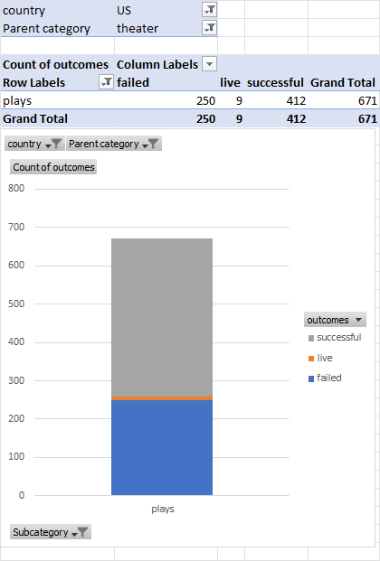
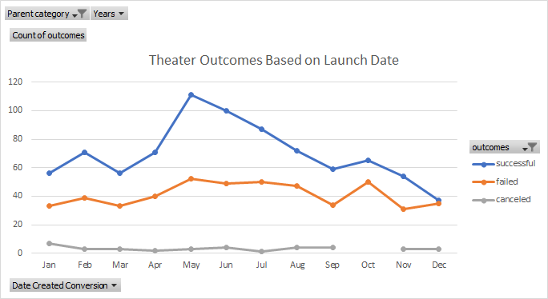
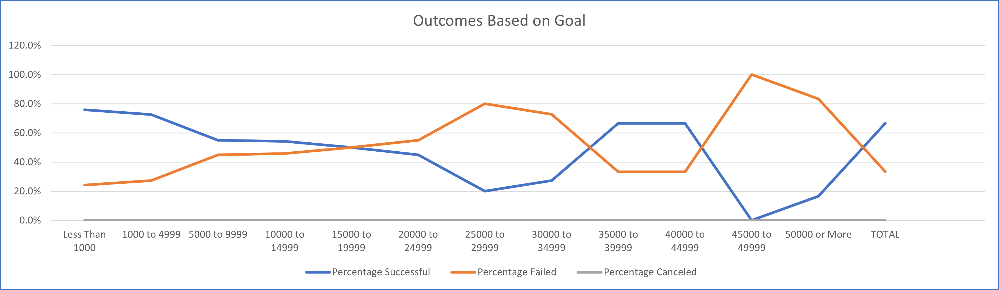

# Kickstarting with Excel

## Overview of Project
Renowned playwright Louise is using Crowdfunding to fund her new play *Fever*. She has an estimated budget of $10k and wants to plan for a successful funding campaign.

### Purpose
Analyze Kickstarter historical fundraising data to identify specific factors that influence successful campaigns. Allow Louise to incorporate the data analysis in order to plan and set up her own campaign for success.

## Analysis and Challenges
In order to focus on relevant data, we first reviewed the 912 theater campaigns in the US:

Focusing further on the 671 campaigns for plays in the US:

### Analysis of Outcomes Based on Launch Date
The first contributing factor for successful campaigns analyzed was the timing of campaign launch. Looking at all theater campaigns by launch month we find:

### Analysis of Outcomes Based on Goals
The second contributing factor for successful campaigns analyzed was the campaign goal. Looking at all theater campaigns by financial goal bands we find:

### Challenges and Difficulties Encountered
While the Kickstarter data was fairly extensive, it is somewhat dated with the campaigns ranging 2010 to 2017. The economy and consumer's giving tendencies may have changed significantly since 2017.

## Results

- The majority of theater campaigns are launched in the Spring and early Summer. The number of failed campaigns remains fairly consistent throughout the year. However, successful campaigns see a significant spike from April to May and slowly decline over the summer.

- The prime window for launching a successful campaign is from April to June with May being the preferred launch month. May has the largest difference (# and %) between successful and failed campaigns. May has the highest number (111) and percentage (67%) of successful campaigns compared to 31% failure rate in May. June would be a good second choice for launch date with 65% success rate compared to 32% failure.

- Theater campaigns are more successful when their goals are below $5k. Campaigns with goals below $5k are the most successful at 73-75% with a fail rate of 24-27%. Campaigns with goals from $5k - $15k are still successful more than 50% of the time but have a failure rate of 45%. A campaign goal of $5,000 maximizes the estimated amount raised while  minimizing the risk of failure.

- As mentioned above, the dataset from Kickstarter is dated and more recent campaign data would be beneficial to determine current fundraising campaign statistics in the current economic environment. Additional data point of theater company/playwrite might help determine if the person launching the kickstarter campaign is a contributing factor toward success or failure.

- Dividing the goal data into smaller ranges might help hone in on an optimal goal amount. Data is concentrated below $10k and dividing into $1k - $2k bands might be insightful while not keeping the sample size large enough to be significant.
